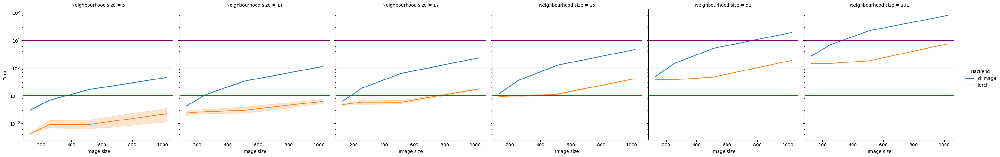
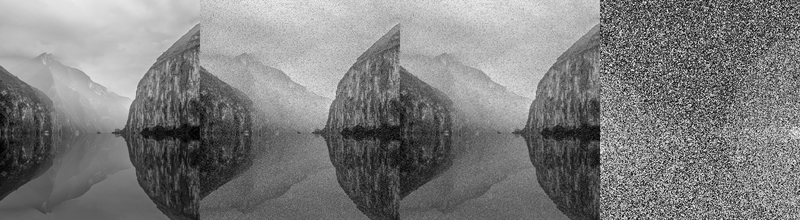

# `torch_nlm` - memory efficient non-local means on PyTorch

## Context

Non-local means takes a long time compute as it is quadratic for the number of pixels in an image. For simple images this is OK. For larger or three-dimensional (common in medical imaging) images this is impeditive for its application. Here, I introduce a PyTorch-based solution which uses convolutions to extract neighbours (non-local means here does not use the complete image but rather a neighbourhood with $n*n$ pixels or $n*n*n$ voxels) and calculates the non-local means average. By porting this to PyTorch we can make easy use of the very efficient GPU parallelization and speed up what oftentimes is a very time consuming algorithm.

## When should you use it?

* **You want to run NLM for small images:** just use `scikit-image`
* **You want to run NLM for bigger images AND you have a GPU:** use this
* **You want to run NLM for relatively big images and you DO NOT have a GPU:** good luck

## Benchmark

I only benchmarked `torch_nlm` against `scikit-image` in 2d because the latter is prohibitively slow in 3d. Results below.



### Brief explanation of non-local means (NLM)

For an image $I \in \mathbb{R}^{h \times w}$ consider pixel $I_{i,j}$ with coordinates $i,j$. 

To obtain the non-local mean of this pixel:

$$\frac{1}{W}\sum{}^{h,w}_{a,b=1} w(I_{i,j},I_{a,b}) * I_{a,b}$$

where $w(I_{i,j},I_{a,b})$ is the weight of pixel $I_{a,b}$ given $I_{i,j}$ and $W=\sum{}^{h,w}_{a,b=1} w(I_{i,j},I_{a,b})$. 

In other words, the non-local means of a given pixel is the weighted average of all pixels. Weights, here, are calculated as the $w(I_{i,j},I_{a,b}) = \exp(- \frac{(I_{i,j} - I_{a,b})^2}{h^2})$, where $h$ is a constant (akin to a standard deviation). To make computation tractable, rather than looping over all pixels, a simple solution is to restrict the neighbourhood to a small square surrounding the image - this is the solution used here.

## Usage

To use this package all you have to do is clone and install this (a `pyproject.toml` is provided so that you can easily install this with [`poetry`](https://python-poetry.org/)). Alternatively, use `requirements.txt` with `pip` (i.e. `pip install -r requirements.txt`).

Two main functions are exported: `nlm2d` and `nlm3d`, which are aliases for the most efficient `torch`-based NLMM versions (`apply_nonlocal_means_2d_mem_efficient` and `apply_nonlocal_means_3d_mem_efficient`), respectively. So if you want to apply it to your favourite image and have a CUDA compatible GPU:

```python
import torch # necessary for obvious reasons
from torch_nlm import nlm2d

image = ... # here you define your image

image_torch = torch.as_tensor(image).to("cuda")

image_nlm = nlm2d(image_torch, # the image
                  kernel_size=11, # neighbourhood size 
                  std=1.0, # the sigma 
                  kernel_size_mean=3, # the kernel used to compute the average pixel intensity
                  sub_filter_size=32 # how many neighbourhoods are computed per iteration
                  )
```

`sub_filter_size` is what allows large neighbourhoods - given that users may have relatively small GPU cards, they may opt for smaller `sub_filter_sizes` which will enable them to load much smaller sets of neighbourhoods for distance/weight calculations. You may want to run a few tests to figure out the best `sub_filter_size` before deploying this *en masse*.

## Implementation details

This code was optimized for speed. Three main functions are provided here - `apply_nonlocal_means_2d`, `apply_windowed_nonlocal_means_2d` and `apply_nonlocal_means_2d_mem_efficient`. The first two are development versions, the latter is the one you should use (exposed as `nlm_2d`).

### `apply_nonlocal_means_2d`

Retrieves all neighbours as a large tensor and calculates the NLM of the image. 

**Problems:** large neighbourhoods will lead to OOM

### `apply_windowed_nonlocal_means_2d`

Does the same as `apply_nonlocal_means_2d` but uses strided patches to do this, thus reducing memory requirements.

**Problems:** leads to visible striding patch artifacts 

### `apply_nonlocal_means_2d_mem_efficient`

Does the same as `apply_nonlocal_means_2d` but loops over sets of neighbourhoods to calculate weights. $W$ is updated as an accummulator. This version requires defining a "batch size" analogue so that only a few neighbours are calculated at a time. This allows for massive neighbourhoods to be computed in a very parallel fashion.

**Problems:** none for now! But time is a teacher to us all.

## Generalising to 3D

The good aspect of this is that it requires very little effort to generalise these functions to 3D. These are made available with the same names as above but replacing `2d` with `3d`. The version you want to use is `nlm_3d`.

## Expected runtime

For a large image such as `assets/threegorges-1024x1127.jpg` ([source](https://www.lightstalking.com/wp-content/uploads/threegorges-1024x1127.jpg); size: 1024x1127), `apply_nonlocal_means_2d_mem_efficient` takes ~3-5 seconds with a neighbourhood with 51x51 pixels when running on GPU.

Example below (obtained by running `python test.py assets/threegorges-1024x1127.jpg`): 



* First panel: original image
* Second panel: original image + noise
* Third panel: original image + noise + NLM
* Fourth panel: difference between original image and original image + noise + NLM

**Note on benchmarking:** while 2d benchmarks are reasonable, 3d benchmarks will take a lot of time because of `scikit-image`'s implementation. Expect times of ~4,000 seconds for a $256 \times 256 \times 256$ images with a neighbourhood size of 17 (`torch_nlm` ran in ~70-80 seconds 😊). You will need `scikit-image` for benchmarking.